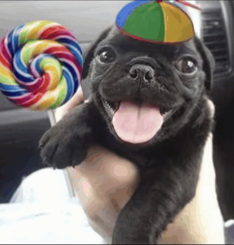

# SINTAXE MARKDOWN

## Títulos

```
# Título Principal
## Título de Seção
### Título de Subseção
```

# Título Principal
## Título de Seção
### Título de Subseção

# Formação de Texto

```
**Texto em negrito**
*Texto em itálico*
~~Texto fechado~~
```

**Texto em negrito**

*Texto em itálico*

~~Texto fechado~~

## Listas

```
- Primeiro item
- Segundo item
  - Subitem identado
  - Outro subitem
    - Subsubitem
  
1. Primeiro passo
2. Segundo passo
3. Terceiro passo 
  ```

- Primeiro item
- Segundo item
  - Subitem identado
  - Outro subitem
    - Subsubitem

1. Primeiro passo
2. Segundo passo
3. Terceiro passo 

## Checklists

```
- [x] Tarefa concluida
- [ ] Tarefa pendente
```

- [x] Tarefa concluida
- [ ] Tarefa pendente

## Links

```
[Visite o Git Hub](https://github.com/)

[Simple Badges](https://badges.pages.dev/)

[Abra outro arquivo do projeto](./OUTRO.md)
```

[Visite o Git Hub](https://github.com/)

[Simple Badges](https://badges.pages.dev/)

[Abra outro arquivo do projeto](./OUTRO.md)

## Código em Linha e Blocos de Código

Para abrir o terminal utilize `Ctrl+j`

```
git status
git add .
git commit -m "Descrição"
git push origin main
```

```
  Uma boa documentação explica o objetivo, o uso e as limitações de um projeto.
  ```
  > Uma boa documentação explica o objetivo, o uso e as limitações de um projeto.

  ## Tabelas

  | Tecnologia | Finalidade |
  |--- | --- |
  |Git | Controle de versões |
  |Github | Hospedagem e colaboração |
  Markdown | Documentação |

  | Alinhado a esquerda | alinhado ao centro | alinhado a direita |
  | :--- | :---: | ---: |
  |texto | texto | texto |

## Imagem




)